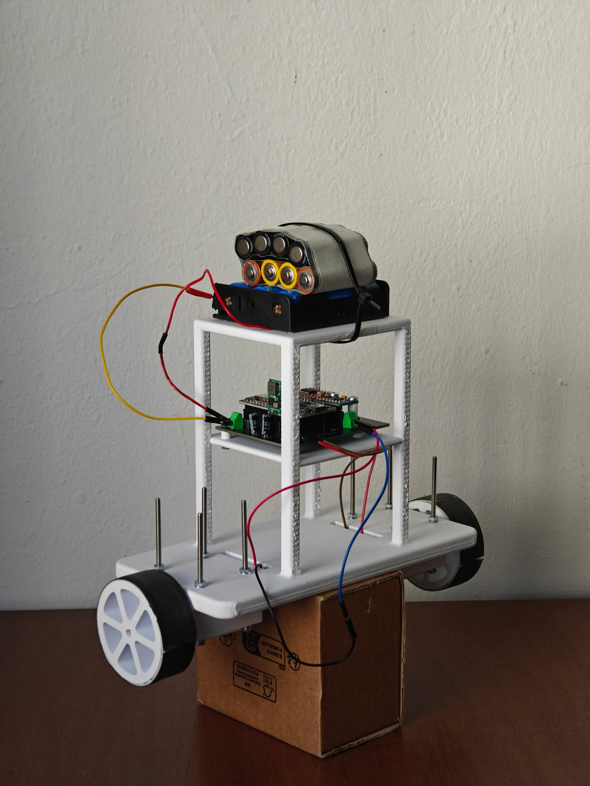
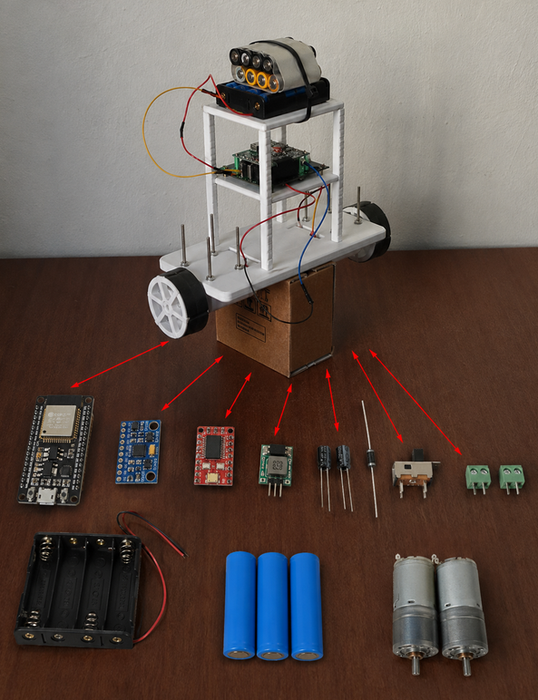
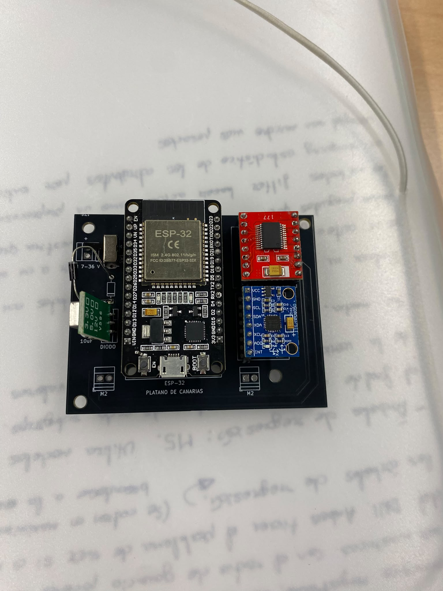
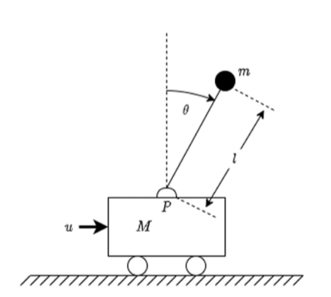
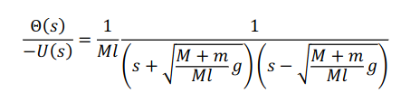

# Pendulo_invertido

  

Realización de un péndulo invertido para la asignatura de Teoria de control en USC Robótica.

La motivación de este proyecto ha sido crear un chasis de un solo eje con dos ruedas tratando de hacer que mediante un contolador PID no se caiga en ninún momento.
La electrónica de este proyecto está contenida en una PCB diseñada en KiCad y los componentes serán descritos a lo largo de este documento.

# Creación PCB
Primero de todo, hemos creado un prototipo basándonos en modelos realizados por compañeros de años anteriores. La placa contenía las tres huellas de los componentes principales:

- **ESP32:** microcontrolador utilizado para gestionar la información proveniente del acelerómetro, calcular la salida del controlador PID y enviar las órdenes correspondientes a los motores.

- **GY-521:** sensor utilizado para medir la inclinación mediante los tres ángulos de Euler:
  - **Roll**
  - **Pitch**
  - **Yaw**

- **ROB-14450:** Puente-h encargado de regular el voltaje que va hacia los motores
Además de otros componentes:
- **Regulador de voltaje, formado por:**
  - **2 condensadores cerámicos de 10uF:** Necesarios para el regulador
  - **LM-7805:** Regula de los ~14V de entrada a 5V para alimetar el microcontrolador
  - **Diodo 1N4743A:** Para no quemar el circuito
  
- **Portapilas x3:** Donde van pilas con una carga de 4.7V
- **2 Motores GA25-370**

  

Aqui mostramos una imagen de la PCB final desarrollada con pines hembra soldados para no tener que soldar directamente los componentes:

  

# Diseño del chasis
## Fundamento teórico
Tomando como base el modelo físico-matemático linealizado de un péndulo invertido sobre un carro desarrollado por Triviño Macías (2020).  

  

La función de transferencia en lazo abierto que relaciona la respuesta angulardel péndulo (Θ(𝑠)) con la fuerza de entrada aplicada al carro (−𝑈(𝑠)) se
define como: 

  

Donde M es la masa del carro, m es la masa del péndulo, 𝑔 es la aceleración de la
gravedad y l es la longitud del péndulo. De esta ecuación se deduce inmediatamente
que el sistema es intrínsecamente inestable debido a la presencia de un polo en el
semiplano derecho (RHP) del plano complejo s, cuya ubicación exacta es:

  

Al analizar matemáticamente esta expresión, se observa que la longitud l se encuentra
en el denominador de la raíz. Por lo tanto, si la masa en suspensión está muy baja (un
valor de l pequeño), el valor del polo inestable aumenta significativamente,
desplazándose hacia la derecha en el eje real.
En la teoría de control, cuanto más alejado se encuentre un polo inestable del
origen, más rápida y violenta será la respuesta divergente del sistema. Físicamente,
esto significa que un péndulo corto o con la masa muy baja caerá a una velocidad
exponencialmente mayor ante cualquier perturbación. Esta aceleración reduce
críticamente el tiempo de reacción disponible para el sistema de control, exigiendo
acciones de control extremadamente agresivas y propensas a la saturación. Por el
contrario, una masa situada a mayor altura (un valor de l más grande) mantiene el polo
inestable más cerca del origen, ralentizando la dinámica de caída y haciendo que el
sistema sea notablemente más dócil y fácil de estabilizar.
